# Installation

    pipx install pdm

# Important

- `pyproject.toml` has to be present in root directory to perform any operations
like `info`, `show`, `install`, `add`, etc.
- `pdm.lock` itself does not allow the operations
- result of `pdm.lock` creation is different for adding group by group and
locking group by group and for adding group by group but locking all at once
- while adding packages to various groups, lockfile contains all groups

# Configuration

## List

    pdm config

## Get

    pmd config <key>

## My configuration

- install cache:

        pdm config install.cache true

    > Notes:
    > 
    > Developer mode has to be activated on Windows to enable using of symlinks.

- venv in project:

        pdm config venv.in_project false
    
    > Notes:
    > 
    > I prefer centralized location of venvs. 

- python providers:

        pdm config python.providers rye

    > Notes:
    >
    > - pdm `venv` location is available in activated environment
    > (and unavailable in deactivated):
    >
    >   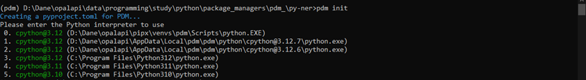
    >   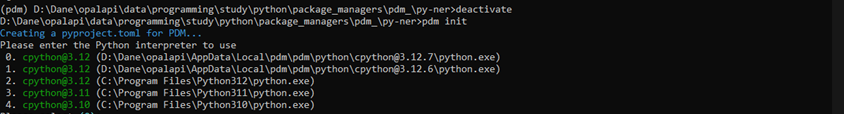
    > 
    > -	`venv` and `path` exclusion does not have impact:
    > 
    >   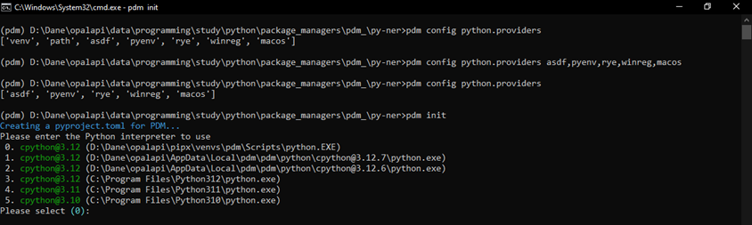
    > 
    > -	`winreg` exclusion has partialy impact (still there is one of system
    > interpreter):
    > 
    >   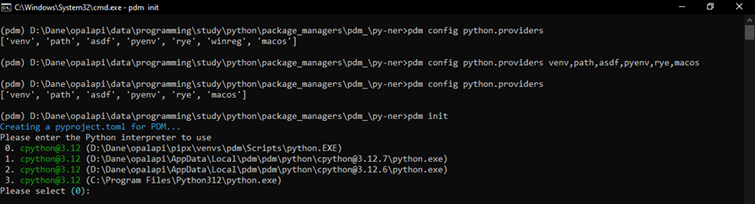
    > 
    > - `rye` (source of interpreters installed via pdm I guessed) exclusion has
    > impact:
    > 
    >   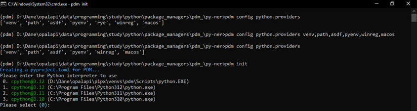
    > 
    > - `winreg` and `rye` exclusion has partialy impact (still there is one of
    > system interpreter):
    > 
    >   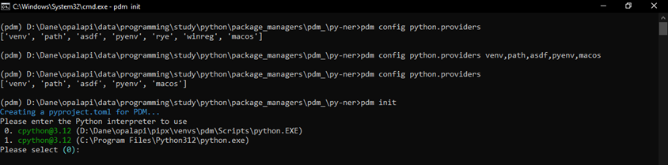
    > 
    > -	`venv`, `path`, `winreg` and `rye` exclusion has partialy impact (still
    > there is one of system interpreter and `venv`/`path` interpreter due to
    > active `venv`):
    > 
    >   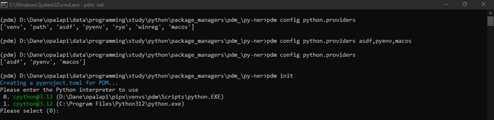
    > 
    > - `venv`, `path`, `winreg` and `rye` exclusion and `venv` deactivation –
    > using the first matched interpreter:
    > 
    >   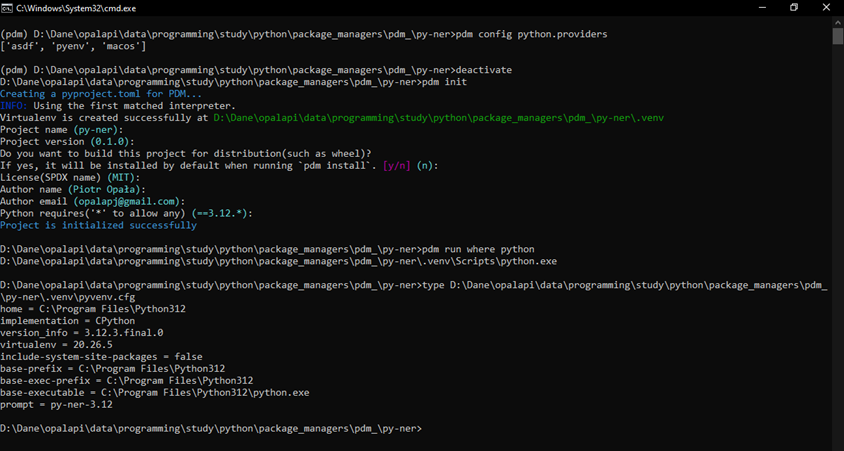

- added subdirectories to `%LOCALAPPDATA%\pdm\pdm`:

    - `templates`

        ```bash
        %LOCALAPPDATA%\pdm\pdm$ git clone https://github.com/opalapj/pdm-templates.git templates 
        ```

- added files to `%LOCALAPPDATA%\pdm\pdm`:

    - `config.toml`

        https://github.com/opalapj/pdm/blob/main/config.toml

## Autocompletion

    pdm completion --help

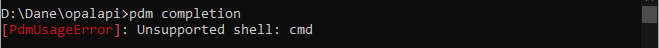

# Get info about project

    pdm info
    pdm info --json

# Project initialization

    pdm init --help

> Notes:
> 
> - For completely empty, new project:
>     - Choose a Python interpreter - ok with docs.
>     - Virtualenv or not - there is no asking for venv creation (2.12.4 -> 2.13.0).
>     - Library or Application - ok with docs.
>         - There is no asking for description (for application).
>     - Specify requires-python - ok with docs.
> - For project with existing pyproject.toml file:
>     - update pyproject.toml

# Managing interpreters

    pdm python --help

## Using another interpreter

- `pdm use`:

    

- environment variable `PDM_PYTHON`:

    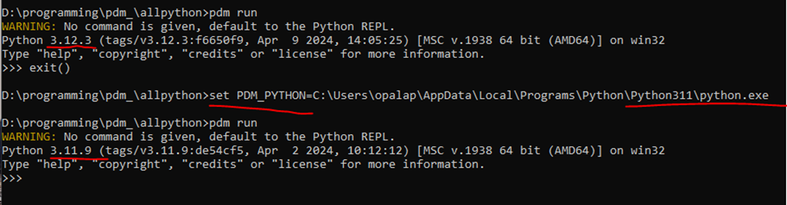

## Run commands or scripts with local packages loaded

    pdm run

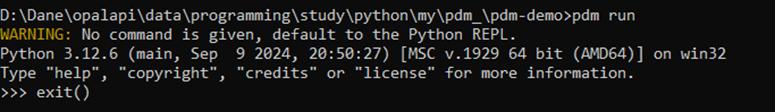

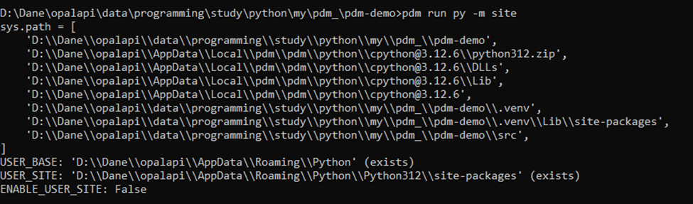

# Managing venvs

    pdm venv --help

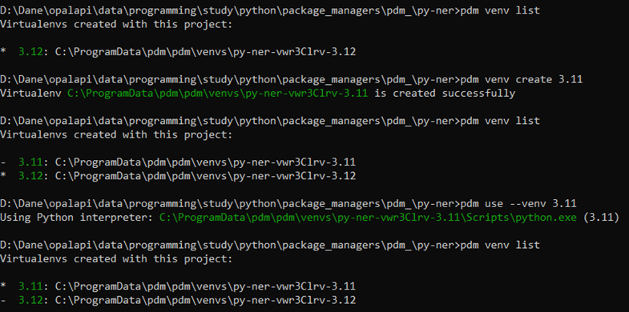

> Notes:
>
> For venv activation:
>
>       for /f %i in ('pdm venv activate <venv name>') do %i
>
> or
>
>       for /f "tokens=*" %i in ('pdm venv activate <venv name>') do %i
>
> or
>
>       pdm venv activate <venv name> | clip
>       ctrl + v

# Managing dependencies

## List

    pdm list --help
    pdm list
    pdm list --tree
    pdm list --sort
    pdm list --fields name,version,groups,licenses,location,homepage

## Add

    pdm add --help
    pdm add
    pdm add pandas requests
    pdm add --group test pytest coverage
    pdm add --dev --group lint flake8 black
    pdm add --frozen-lockfile --no-sync pandas requests

> Notes:
>
> - application (the project itself is not installed):
>
> 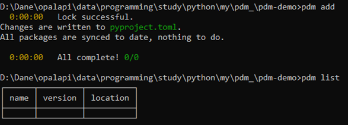
> 
> - library (the project itself is installed):
>
> 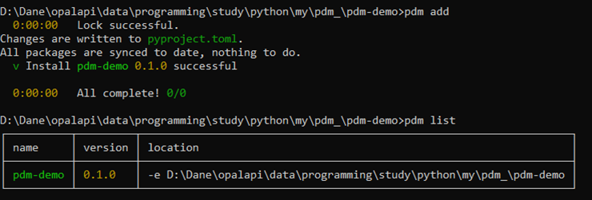

## Lock

    pdm lock

## Install

    pdm install --help
    pdm install

> Notes:
>
> All development dependencies are included as `--prod` is not passed and `-G`
> does not specify any `dev` groups.

## Export

    pdm export --help
    pdm export
    pdm export --no-hashes --pyproject --output requirements.txt
    pdm export --no-hashes --output requirements-lock.txt

# Workflow

1. Project initialization
    - `venv` is created in given location (`pdm config venv.location`)
2. Adding dependencies
    - without locking
    - without synchronization
3. Locking of dependencies
4. Project/dependencies installation/synchronization

# Plugins

Development workflow described in plugin template.

## Plugin naming convention

Each plugin name should contain `pdm-` prefix, e.g.:

    pdm-hello
    pdm-learn

# Frequently used command options

- info = ["--json"]
- add = ["--frozen-lockfile", "--no-sync"]
- list = ["--fields", "name,version,groups,licenses,location,homepage"]
    - still available: --sort, --tree
- export = ["--no-hashes", "--output", "requirements.txt"]
    - still available: --pyproject

# Improvement proposals

- add group name to developed package

    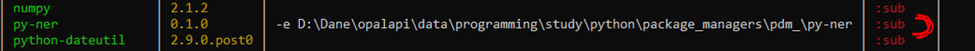

- add support for `.env`
- add relative path as `venv.location` – if user would like to have directory
with multiple venvs in project root e.g. `venv.location = {PROJECT_ROOT}/venvs`
- add options constant not only on project level, but also on user level to
not repeat constants with pdm init command i.e.
`pdm init –dist C:\ProgramData\pdm\pdm\template`

# Misc.

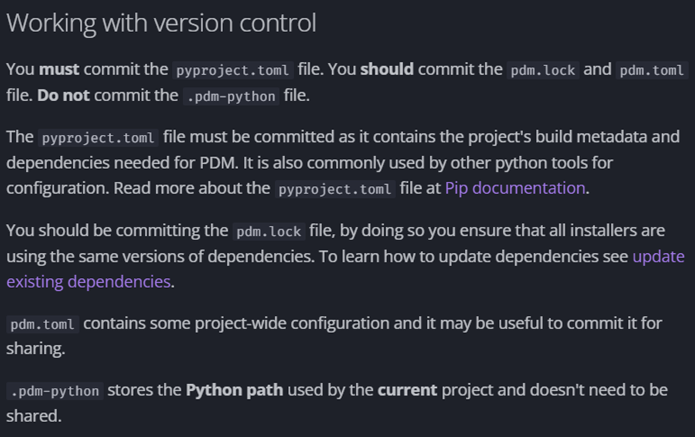

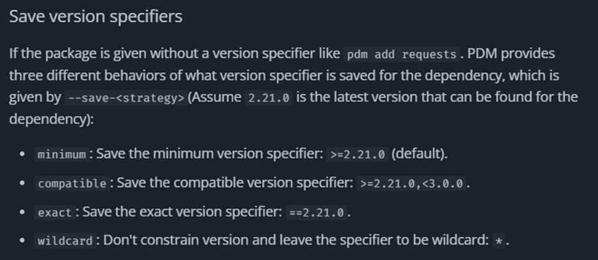
